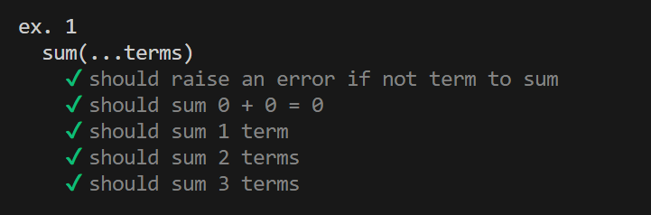
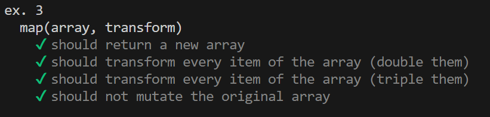
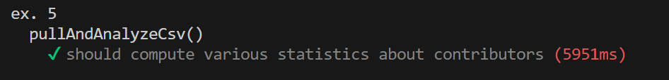

# info--Web-Development-for-IT-Engineer

## Description

Vous trouverez ici les informations concernant le cours de Web Development for IT Engineer.

Chaque TP sera dans un dossier séparé.
Pour lancer les fichiers il faut utiliser la commande `node` suivie du nom du fichier.

Bien sûr il faut avoir node d'installé sur votre machine.

Participant:

- [Nathan_Morel]()
- [Laura_SAADA]()
- [Minggao_GONG]()

## TP1

Le TP1 est disponible dans le dossier `TP1`.
Il se divise en 2 parties:

- Une partie pour les exercices 1, 2 et 3 disponible dans le fichier `exo1-2-3.js`
- Une partie pour l'exercice 4 et 5 disponible dans le fichier `exo4-5.js`

Concernant le TP1 nous avez aussi la possibilité de lancer la comande `npm run test` pour lancer les tests il vous faudra installer les dépendances avec la commande `npm install` avant de lancer les tests.

Vous trouverez ci-dessous les différents tests réussi pour le TP1:

- [x] Exercice 1
      
- [x] Exercice 2
      
- [x] Exercice 3
      
- [x] Exercice 4
      
- [x] Exercice 5
      

## TP2
